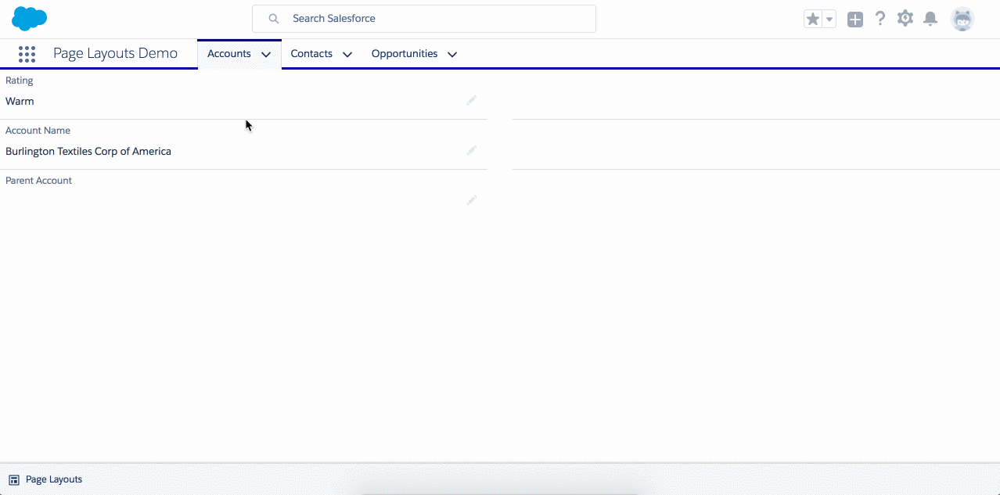
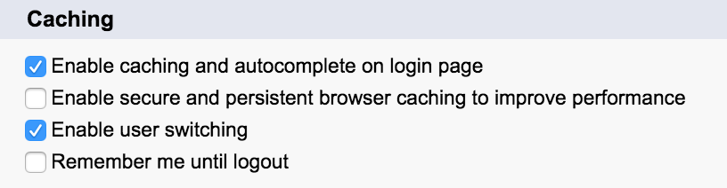

ffdc-df17-mdapi
===

Deploy using the button below and log into your Dev Hub when prompted.

 

Background
---

This repo accompanies the Dreamforce '17 session **[Build Self-configuring Apps with the Apex Metadata API](https://success.salesforce.com/Sessions#/session/a2q3A000001yu10QAA)**.

The Summer '17 release finally brings native Apex support for the Metadata API! This sample app allows you to compare altering page layouts with both the [native Metadata API](https://releasenotes.docs.salesforce.com/en-us/summer17/release-notes/rn_apex_metadata.htm) and the [FinancialForce Apex Metadata API](https://github.com/financialforcedev/apex-mdapi).

Tips
---
* The FinancialForce Apex Metadata API effectively makes a callout from the Salesforce server into your org, on your behalf. It does this by reusing your session.
	* You will need to add a remote site setting for the current org's subdomain.
	* You must not enable any security settings that prevent users with a different IP from using your Session Token.
	
* Salesforce use persistent caches in Lightning Experience to improve performance, so page layout changes may not be immediately visible even after a hard refresh. You can disable the caching in Setup.
	* Setup > Security > Session Settings > Caching.
		* Uncheck Enable secure and persistent browser caching to improve performance
	
	* There is more discussion in this [StackExchange question](https://salesforce.stackexchange.com/questions/134111/salesforce-lightning-component-cache).

Deployment
---
This app is built and deployed via SFDX.

1. If you don't have a Dev Hub, sign up for a trial here:
	* Complete the form on the [sign up page](https://developer.salesforce.com/promotions/orgs/dx-signup)
	* Note. The org will expire in 30 days
1. If you don't have the SFDX CLI:
	* Download it [here](https://developer.salesforce.com/tools/sfdxcli)
	* Or install via brew
		* `brew cask install caskroom/cask/sfdx`
1. Create a scratch org:
	* `sfdx force:org:create -f config/project-scratch-def.json -s`
1. Push source to scratch org:
	* `sfdx force:source:push`
1. Assign yourself the PageLayouts permission set:
	* `sfdx force:user:permset:assign -n PageLayouts`
1. Launch the scratch org in a browser:
	* `sfdx force:org:open`

Contributing to the Repository
---
If you find any issues or opportunities for improving this respository, fix them!  Feel free to contribute to this project by [forking](https://help.github.com/articles/fork-a-repo/) this repository and make changes to the content.  Once you've made your changes, share them back with the community by sending a pull request. Please see [How to send pull requests](https://help.github.com/articles/creating-a-pull-request//) for more information about contributing to Github projects.

Reporting Issues
---
If you find any issues with this demo that you can't fix, feel free to report them in the [issues](https://github.com/financialforcedev/df17-mdapi/issues) section of this repository.